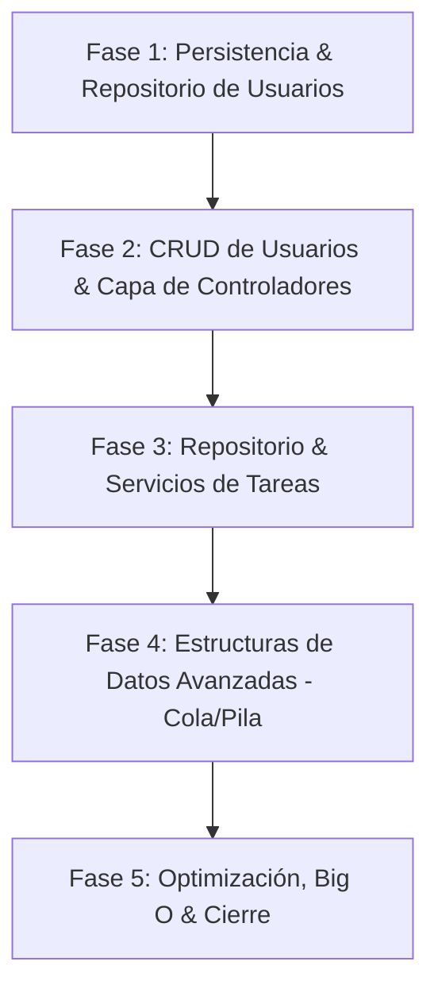

# Plan de Implementación: Task Manager API (Mentoring & Aprendizaje Activo)

Este proyecto está diseñado para aprender y dominar JavaScript moderno, asincronismo, estructuras de datos y complejidad algorítmica mientras construyes una API REST limpia y modular siguiendo la arquitectura en capas:
`[Cliente HTTP] → [Rutas] → [Controlador] → [Servicio] → [Repositorio] → [Base de Datos (JSON)]`

Como tu CTO y mentor, guiaré cada paso a través de **pistas socráticas** para que descubras las respuestas y diseñes el código tú mismo, asegurando un aprendizaje duradero.

---

## Fases del Proyecto y Roadmap de Aprendizaje

El proyecto se dividirá en 5 fases incrementales. En cada una incorporaremos conceptos técnicos clave y cerraremos con un bloque de desafíos prácticos y preguntas conceptuales.

### Fase 1: Persistencia en JSON y Repositorio de Usuarios
* **Objetivo de negocio**: Crear la base para el almacenamiento persistente en archivos JSON e implementar el repositorio de Usuarios.
* **Conceptos de estudio**:
  - **Asincronismo**: Event Loop, Promises, Async/Await (aplicados a la lectura y escritura con el módulo `fs/promises`).
  - **Estructuras de Datos**: Arrays y Objects básicos.
  - **Complejidad (Big O)**: Analizar la eficiencia del acceso y modificación en archivos/arreglos de memoria.
* **Entregable**: Un repositorio `UserRepository.js` funcional que lea y escriba en `data/users.json`, con soporte para inserción, búsqueda y borrado lógico.

### Fase 2: CRUD de Usuarios y Capa de Controladores (Routing & Express)
* **Objetivo de negocio**: Exponer endpoints REST para la gestión de usuarios e implementar validaciones y control de flujo.
* **Conceptos de estudio**:
  - **Funciones**: Callbacks (middlewares de Express), Closures (para crear generadores de handlers o validadores personalizados), Higher Order Functions (para manejar errores asíncronos sin bloques try/catch repetitivos).
* **Entregable**: Endpoints `/users` (POST, GET, PATCH, DELETE) comunicados con el servicio y repositorio, listos para pruebas.

### Fase 3: Repositorio y Servicios de Tareas (Relación 1 a Muchos)
* **Objetivo de negocio**: Permitir a los usuarios crear, editar, listar y borrar (lógicamente) sus tareas, validando categorías y estados permitidos.
* **Conceptos de estudio**:
  - **Funciones avanzadas**: Currying y Composición de funciones (para validaciones de negocio y filtros modulares de tareas).
  - **Estructuras de Datos**: Uso de `Map` y `Set` para mejorar las búsquedas por IDs y gestionar de forma única las categorías o tags.
* **Entregable**: Endpoints `/tasks` con filtrado por categorías, estados (`comenzar`, `en proceso`, `hecha`), y restricciones para que solo el creador pueda modificar su tarea.

### Fase 4: Estructuras de Datos Avanzadas (Cola y Pila)
* **Objetivo de negocio**: Añadir una funcionalidad de procesamiento asíncrono o historial a las tareas.
  - *Ejemplo*: Una cola (Queue) de procesamiento de reportes/notificaciones pendientes de tareas, o un historial tipo Pila (Stack) para "deshacer" la última acción de estado de una tarea.
* **Conceptos de estudio**:
  - **Estructuras de Datos**: Stacks (Pilas) y Queues (Colas). Implementación manual y análisis de rendimiento.
  - **Complejidad**: Comparación de la inserción y remoción en una Pila/Cola frente a un Array estándar (Big O).
* **Entregable**: Funcionalidad de cola de notificaciones o pila de deshacer integrada en los servicios del sistema.

### Fase 5: Optimización, Big O y Cierre (CTO Review)
* **Objetivo de negocio**: Auditoría técnica del código, medición de rendimiento y consolidación de conocimientos.
* **Conceptos de estudio**:
  - **Big O general**: Análisis de complejidad de toda la aplicación.
  - **Event Loop**: Entendimiento profundo de cómo Node gestiona las lecturas/escrituras en archivos y las peticiones concurrentes.
* **Entregable**: Repositorio limpio con tests manuales validados y documentación técnica.

---

## Tablero Kanban de la Fase 1 (Siguiente Paso)

Para comenzar con la **Fase 1**, nos enfocaremos en las siguientes tareas:

- [ ] **Tarea 1.1**: Diseñar y crear el archivo `data/users.json` con una estructura de datos base.
- [ ] **Tarea 1.2**: Resolver las preguntas guía sobre el Event Loop y la carga de módulos ES (pendientes en `Base2.md`).
- [ ] **Tarea 1.3**: Implementar la lectura asíncrona de archivos en el repositorio de usuarios usando Promises / Async-Await.
- [ ] **Tarea 1.4**: Implementar métodos para escribir en el archivo JSON manteniendo la consistencia de los datos.
- [ ] **Tarea 1.5**: Analizar la complejidad algorítmica (Big O) del repositorio actual al buscar o insertar un elemento.

---

## Preguntas Abiertas / Decisiones del Usuario

> [!IMPORTANT]
> Revisa los siguientes puntos de diseño antes de comenzar a escribir código:
> 1. **Estructura del Repositorio**: ¿Deseas que los datos de usuarios y tareas estén separados en archivos JSON diferentes (`users.json` y `tasks.json`) para facilitar el análisis aislado, o prefieres un único archivo relacional? *(Recomendamos archivos separados por modularidad y facilidad de escalabilidad en la arquitectura).*
> 2. **Enfoque de Asincronismo**: ¿Prefieres que usemos el módulo nativo de Node `fs/promises` directamente con sintaxis `async/await`, o te gustaría implementar primero tus propias envolturas con Promises para afianzar el entendimiento del puente entre callbacks y promesas?
